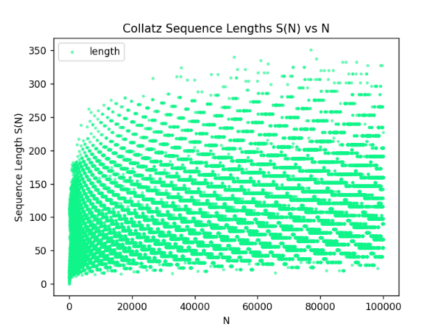
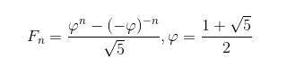
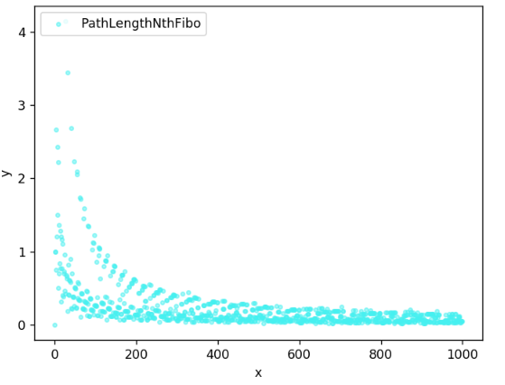
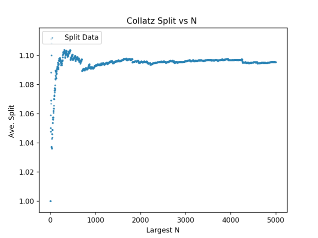

# Collatz
Code By Michael Sherif Naguib
## About the Collatz Conjecture
The *Collatz Conjecture* states that given a function
```
f(n) = n/2         (if n mod 2 =0),
       3*n +1       otherwise
```
And the sequence defined by:
```
a_i = n            for i=0,
      f(a_(i-1))   otherwise
```
The conjecture states that the sequence will always return to 1 for any starting value of x_0. This could be thought of as constructing
an iterated function system for the function ```f``` and determining if it always retunrs to  1: 
```f(...f(f(f(f(f(x_0)))))...) = 1 for x_0 in Positive Integers  given a finate number of calls will the IFS yeild a 1?``` (however this is only approximatly equivilant)...
The collatz conjecture has been called the problem that both mathematics and computer science is not prepared to solve. There are many intricate patterns that can come out of counting the length of the sequence for any given value of x_0

## Generated Plots
- This first plot depicts the sequence length for an integer n with respect to n:


- I then began to wonder what these sequence lengths looked like for one of my favorite groups of numbers: the fibonacci sequence. 
- Using *Binet's* formula (listed below) for the nth fibonacci number, I then calculated the sequence length of the first thousand fibonacci numbers. The resulting graph yielded an interesting bifurcation.
<!--F_n = \frac{\varphi^n - (-\varphi)^{-n}}{\sqrt{5}}, \varphi=\frac{1 + \sqrt{5}}{2} -->
- Binet's Formula: this is one of my favorite equations as it expresses the nth term of a normally recursively defined function in a closed form solution, and the *Golden Ratio* appears. ALong with proper rounding Binet's formula is perfect solution to calculating fibonacci numbers non recursively up to a certain size (precision and overflow can become issues when n is very large


- This graph depicts the length of the collatz sequence for the first 1k fibonacci numbers. X: the x'th Fibonacci Number; Y: Collatz Path Length of the x'th fibonacci number



- As of yet the reason for the bifurcation is not entirely clear to me beyond the fact that the exponential scale of the fibonacci numbers may skew and make more pronounced a natural bifurcation already present in the graph of Collatz Sequence Length of n vs n; 

- Additionally one of the other experiments I ran was to determine the branching factor of the collatz tree. Whereas before I worked with the length of the collatz sequence; Here I worked with the specific values in that sequence; i.e it can be shown that any value that can be expressed as 2^k where k is a whole number; the sequence associated with that number will always return to the trivial loop. 
- So for example: 10->5->16->8->4->2->1->4 ... etc ...  Now consider the sequence 32->16->8->4->2->1->4 ... etc ... Notice how both the values 32 and 5 enter node 16; My goal was to build the parital tree for the numbers up to a certian value. 
- Given that the conjecture is true then I would always be able to attach any branches I generate to the tree. The trick was to be efficient in calculation of the sequences and calculate only partial sequences until we hit a value that was already present in the tree and attach the branch to that location; (i.e a dictionary was used to store references to nodes in the tree....)
- The next step was to traverse the tree keeping an average of the number of splits across nodes;
- The following graph depicts the average branching (split) factor for a tree generated only evaluating input numbers less than N ( so for example say N=5 ... since the sequence for 5 is 5->16->8->4->2->1->4   16 **is** evaluated ... we do not evaluate for example the numbers 7 as the number [1,5] do not contain any 7 in the sequence and the largest number is N=5)


## About the Code: ```Collatz.ipynb```
* A repo for the purpose of exploring the *Collatz Conjecture* and plotting points graphically
* The code is optimized using memoization to compute different values concerning the collatz conjecture
including: sequence length, sequence values, collatz function values, etc. The calcualtions are quite fast however it uses recursion: (an iterative calculation method will need to be coded ... if a number with a large enough seqence length is calculated right off the start and can't terminate early because there are not values for the intermediate terms ... python's activation stack might reach its maximum recursive depth)
* The code plots a few  graphs and then I begin expiramenting with whatever comes into my head ...
* *Code includes a 3D plot* of the collatz sequence length ... inverting the points with respect to how many points were compued then switching the axis yeiled a curved rectangular prisim grouping of points for sufficienctly low point quantities; This is not meant to be rigorous but to show the innate patters
that emerge in the Collatz Conjecture
* **TWO FILES** The old code is in ```Collatz.py``` the new code is in ```Collatz.ipynb```
## Dependancies 
* Anaconda
* numpy,math,random,sys,bisect,tqdm,multiprocessing
* My Plotting Library etc *NumLib* (see my github repos ... this has its own deps...)